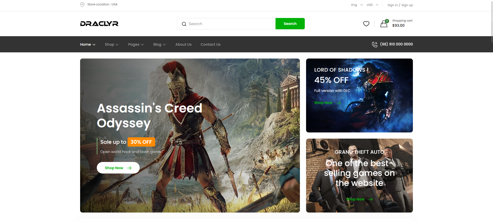
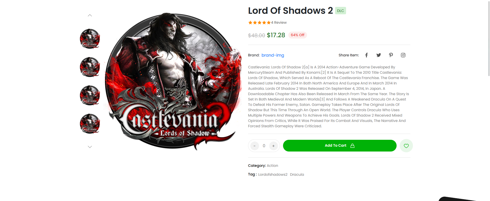

# About Ronic

<h2 text-align="center">
🔥A store website based on html, css and javascript with the topic of selling video games, where all coding principles are observed.😎</h2>

A view of the main part of the template:

</a>

This website is equipped with a very professional store section that you can expand further.😏:

</a>

In the purchase section of a product, all the details of the product can be viewed and changed, which provides better facilities to the customer.:

</a>

And finally, I will be very happy if you rate the project❤️

