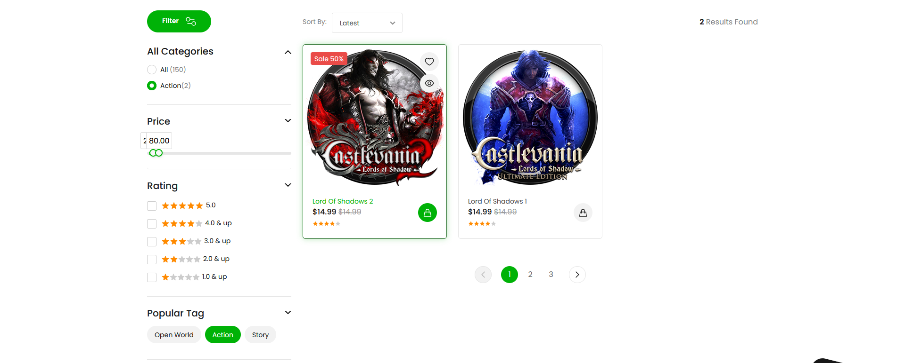

# About Gamerex

<h2 text-align="center">
🔥"A video game store website developed using HTML, CSS, and JavaScript, adhering to all coding principles to ensure optimal functionality and design😎</h2>

A detailed view of the core section of the template, highlighting its essential design and functionality:

</a>

This website features a highly professional store section that can be further expanded to accommodate additional functionalities and offeringsğŸ˜:

</a>

In the product purchase section, all details can be viewed and modified, ensuring enhanced convenience and functionality for the customer:

</a>

This template includes a comprehensive user dashboard, allowing customers to review their purchase history and manage account settings with ease.

</a>

Finally, I would be delighted if you could rate the project❤️

